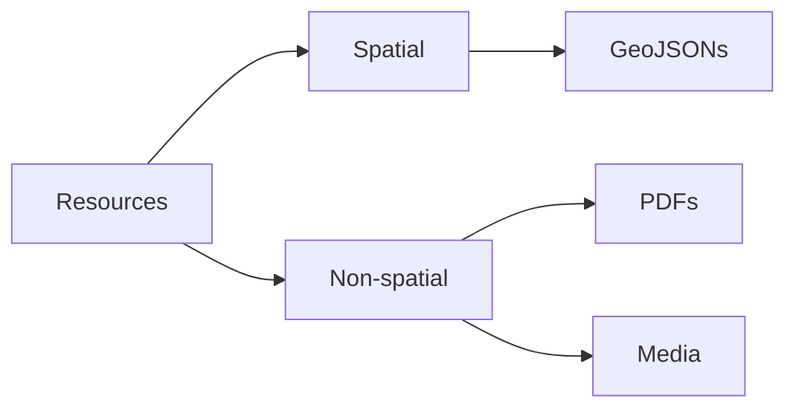
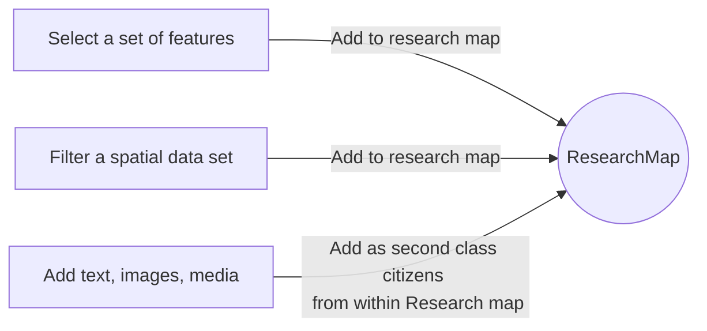
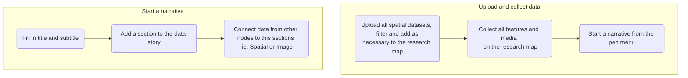
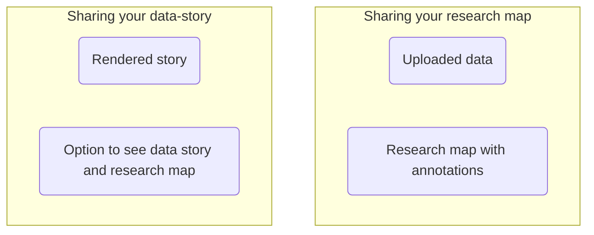

<h1 align="center">

Research Narratives

</h1>

<bold align="center"> A webapp to augment data analysis, visualization and storytelling through data driven mindmaps.
This was developed as part of my internship at the [Urban Informatics Lab at IIHS, Bengaluru](https://iihs.co.in/urban-informatics-lab/) </bold>

[](https://app.netlify.com/sites/researchnarratives/deploys)

This was designed and developed to help students, educators, journalists and researchers to have a common whiteboard that links data, writing and visualization. This project is a proof of concept.

## Components

### Resources



Resources can be any document that you want to annotate and link to your mind map. This can be spatial data, papers, news articles, media and so on. Spatial data is currently treated as first class data, and is the only data that can be annotated. PDFs and media can be annotated, but not spatially and neither on the interface

## What is a research map?



A research map is the analogue of a mind map, but everything on it carries some annotated data.
Once you upload Spatial data, you can select and/or filter a set of features and add them to the Research map.
You can link these features to other features, just like you would on a mind map.
You can also add text, and images alongside these to the Research map.

## How do I create data stories?



Once you have annotated and built a web of your narrative, you can start a narrative from the Pen menu. Each narrative section contains text, any media and other spatial data that you want to display alongside it.
You can

- Add a title to the narrative section
- Add text to the narrative section
- Add media to the narrative section
- Add spatial data to the narrative section

## How is non-spatial data annotated?

PDF and AV media annotation on the interface is not yet supported. Media can be annotated through the notes field. Pertinent annotations can be displayed in the Narrative section as required for the time being.

## How do I share what I have created?



Your research map is shareable, so is your data-story.
Your research map will contain all the data that you have uploaded, and the annotations that you have made.

# Technical FAQ

## Roadmap and status

- [x] Spatial data annotation
- [ ] Non-spatial data annotation
- [x] Datastory creation
- [x] Datastory sharing
- [ ] Datastory export
- [ ] Communities
- [ ] User profiles
- [ ] Sharing permissions
- [ ] Datastory commenting

## How do I contribute?

Please express your interest via email adhavan dot sivaraj 16 at gmail dot com or start a discussion thread.

## How do I run this locally?

```
    git clone https://github.com/rungdung/research-narratives-UI.git
    npm install --force
    npm run dev
```

## How do I deploy this?

- Supabase account and API keys
- Set up env vars for Supabase in Netlify or other alternatives

## How do I cite this?
