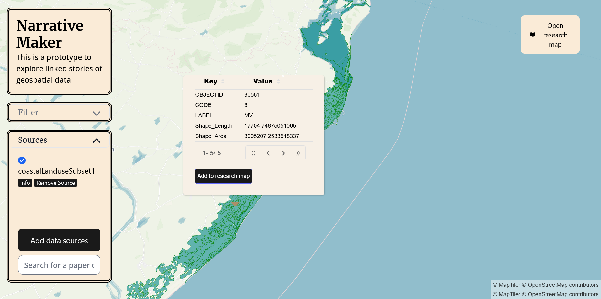
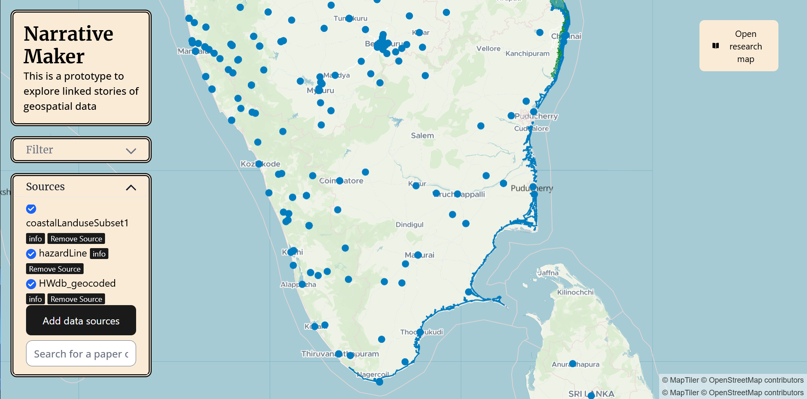
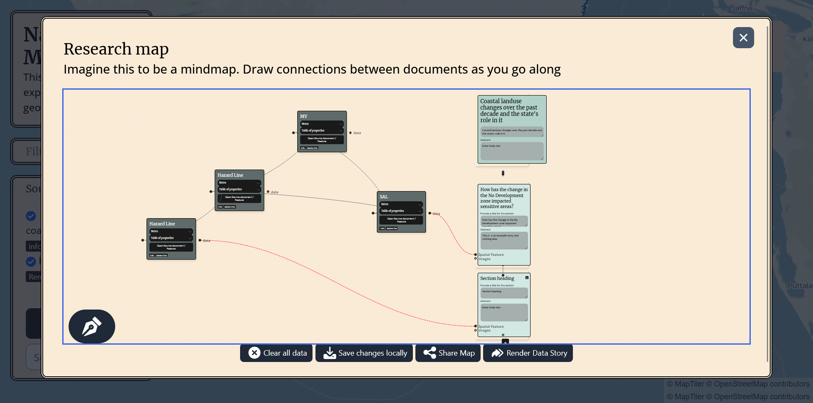
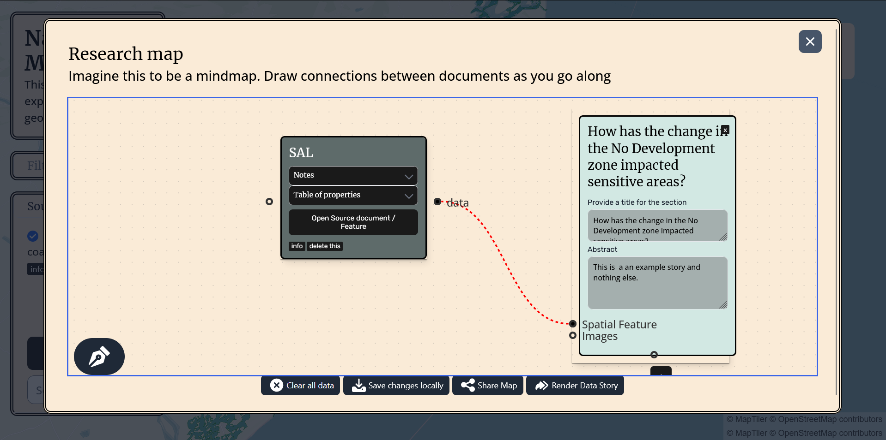
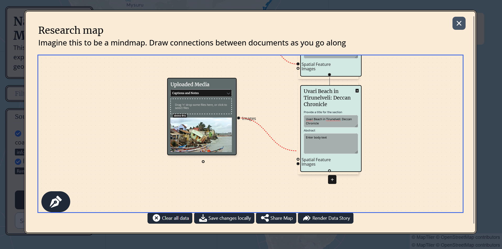
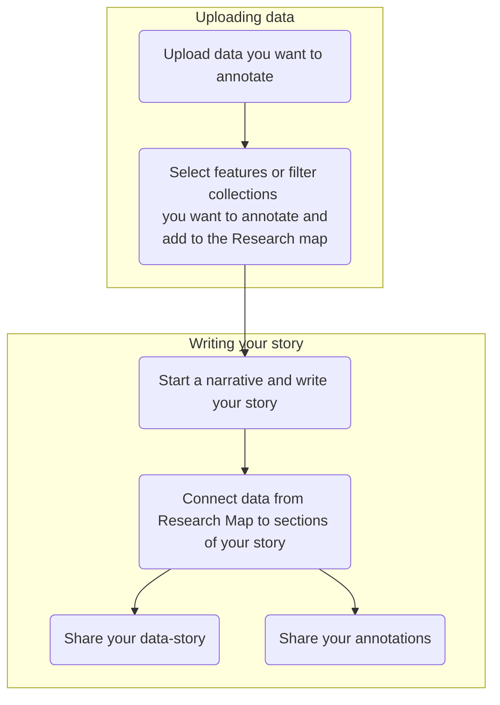
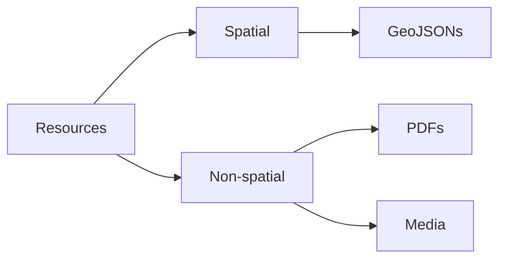
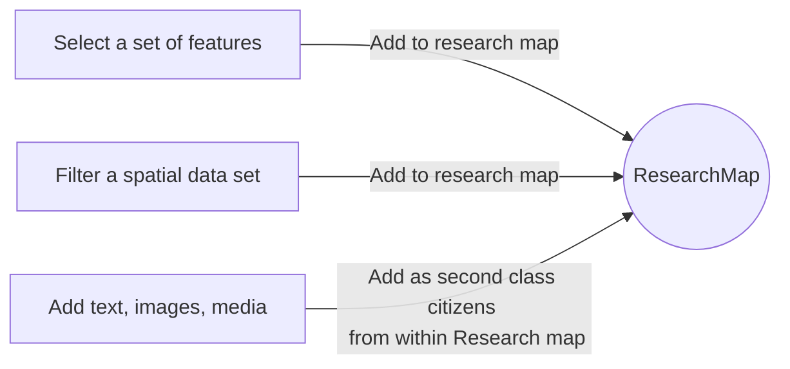
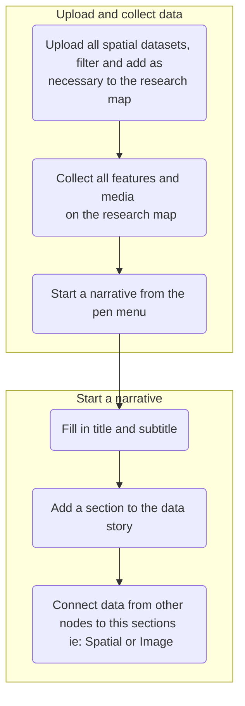
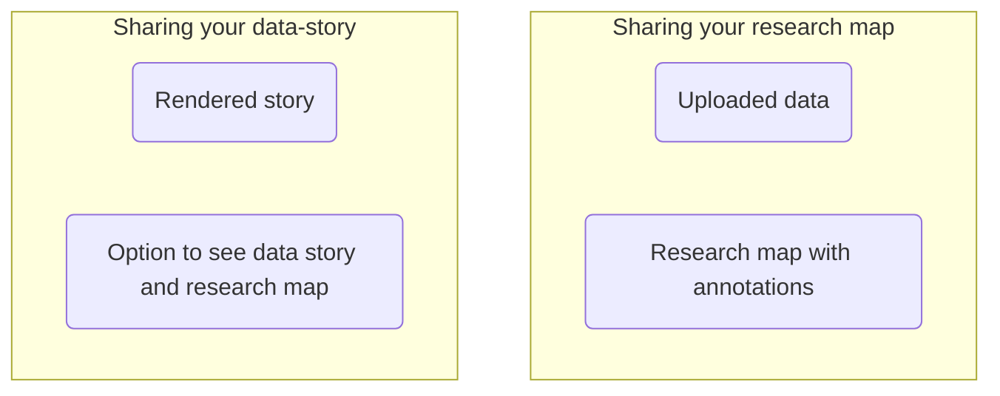

<h1 align="center">
Research <br>
Narratives

[](https://researchnarratives.netlify.app)
[](https://github.com/rungdung/Research-Narratives/wiki)
[](https://app.netlify.com/sites/researchnarratives/deploys) 

</h1>

<div align="center">

A web app to augment data analysis, visualization and storytelling through **data-driven mindmaps**. This was designed to help _students, educators, journalists and researchers_ have a common whiteboard that _links data, writing and narrative visualization._

<br>

This _proof of concept_ has been developed as part of my internship at the [Urban Informatics Lab at IIHS, Bengaluru](https://iihs.co.in/urban-informatics-lab/)

</div>

<p float="left">









</p>

## Alpha Demo

[Use the alpha demo here. ](https://researchnarratives.netlify.app/) (DESKTOP ONLY!)
This is a proof of concept and may not live up to production standards, use it with caution. Please report any bugs or issues that you find. Use the discussions tab to provide feedback or to start a discussion. There are no warranties provided.

## How do I use this in general?



## Components

### Resources



Resources can be any document that you want to annotate and link to your mind map. This can be spatial data, papers, news articles, media and so on. Spatial data is currently treated as first-class data and is the only data that can be annotated. PDFs and media can be annotated, but not spatially and neither on the interface. This is a work in progress. So is support for other spatial formats.

### What is a research map?



A research map is the analogue of a mind map, but everything on it carries some annotated data. Once you upload Spatial data, you can select and/or filter a set of features and add them to the Research map.

You can link these features to other features, just like you would on a mind map. You can also add text, and images alongside these to the Research map.

### How do I create data stories?



Once you have annotated and built a web of your narrative, you can start a narrative from the Pen menu. Each narrative section contains text, any media and other spatial data that you want to display alongside it.
You can

- Add a title to the narrative section
- Add text to the narrative section
- Add media to the narrative section
- Add spatial data to the narrative section

### How is non-spatial data annotated?

PDF and AV media annotation on the interface is not yet supported. Media can be annotated through the notes field. Pertinent annotations can be displayed in the Narrative section as required for the time being.

### How do I share what I have created?



Your research map is shareable, and so is your data story.
Your research map will contain all the data that you have uploaded, and the annotations that you have made.

# Technical FAQ

## Roadmap and status

- [x] Spatial data annotation
- [ ] Non-spatial data annotation
- [x] Datastory creation
- [x] Datastory sharing
- [ ] Datastory export
- [ ] Communities
- [ ] User profiles
- [ ] Sharing permissions
- [ ] Datastory commenting

## How do I contribute?

Please create a discussion thread or email at adhavan[dot]sivaraj16+RN[at]gmail[dot]com with Research Narratives as subject if you would like to contribute.

## How do I run this locally?

```
    git clone https://github.com/rungdung/Research-Narratives.git
    npm install --force
    npm run dev
```

## How do I deploy this?

- Set up a Supabase project and API keys
- Set up a MapTiler account and API keys

# License

This project is licensed under the Apache License 2.0 - see the [LICENSE.txt](LICENSE.txt) and [NOTICE.txt](NOTICE.txt) file for details.
